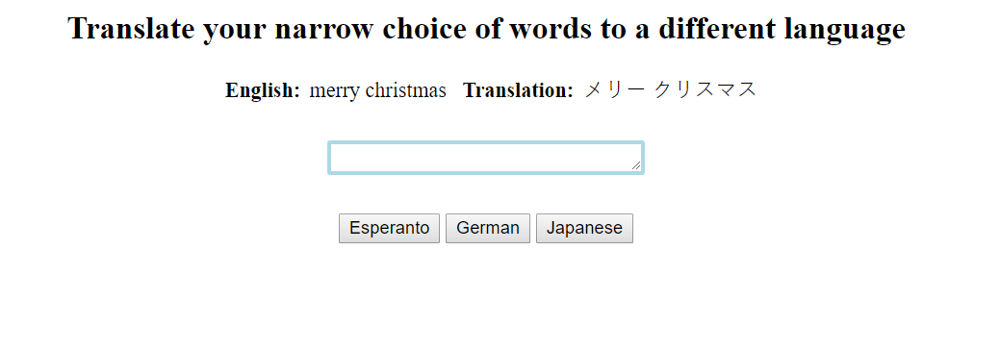

# language translator

## Purpose

To translations a small set of words into Espiranto, German, or Japanese, based on the options selected.

The data structure included three separate objects and multiple `for` loops to get the value entered and output the selected language.

## Snapshot

## To View

1. Clone repository to local machine.
1. Using http-server (`$ npm install http-server`) feed project to the port 8888 (`hs -p 8888`)
1. open localhost:8888 in your browsers address bar

## Notes

The CSS file uses FLEXBOX. If you are running this on Internet Explorer, the styling won't work properly